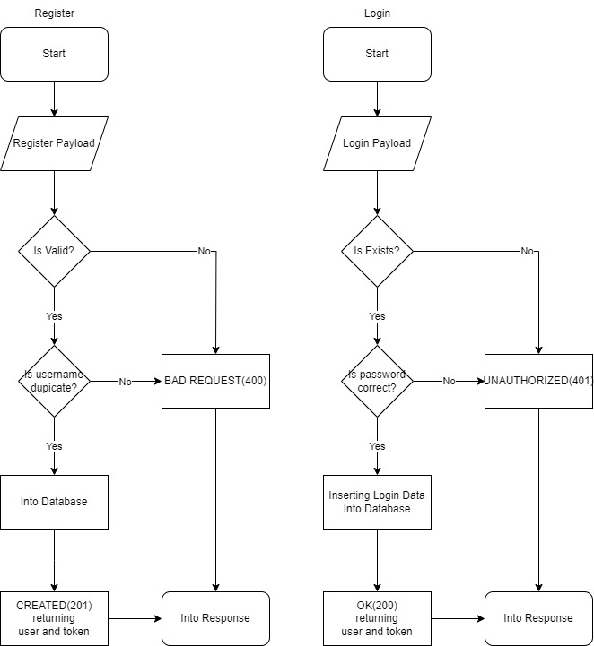
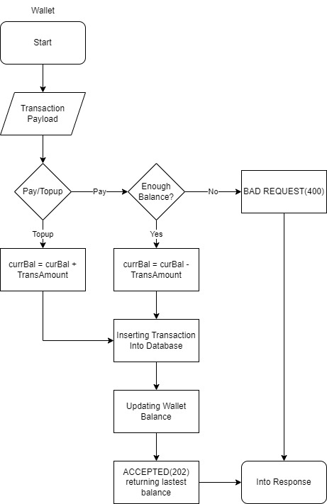
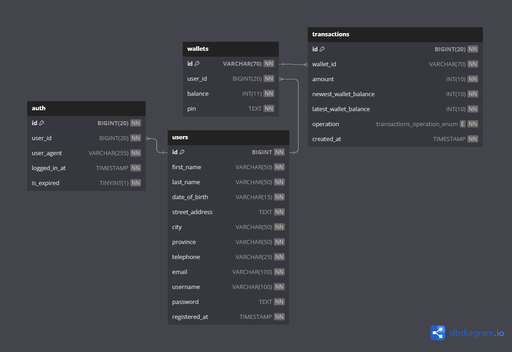
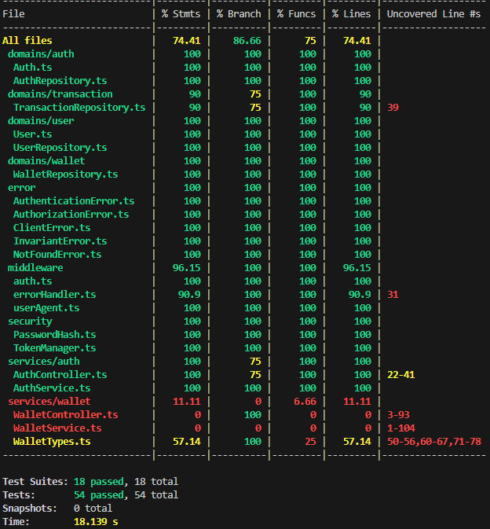

# Starworks Backend Test
---
###### API deployed at [starworks.reytama.com](https://starworks.reytama.com) using Nginx and Cloudflare with ECS from AlibabaCloud

#### How to start the server:
1. copy/rename .env.example to .env
2. change env variables
3. run `npm install` or `docker build . -t rey/starworks:latest` for docker use
4. run the migration `npm run migrate:up` or `docker compose run --rm migrator`
5. start the server `npm run dev` or `docker compose up -d`

#### For postman use
- Import collection and environment from `misc`
- Explore the endpoints
- [API documentations](https://documenter.getpostman.com/view/8272746/2s9YRB3CJT)
### Auth Flowchart

### Wallet Flowchart

### Database

### Test Results
